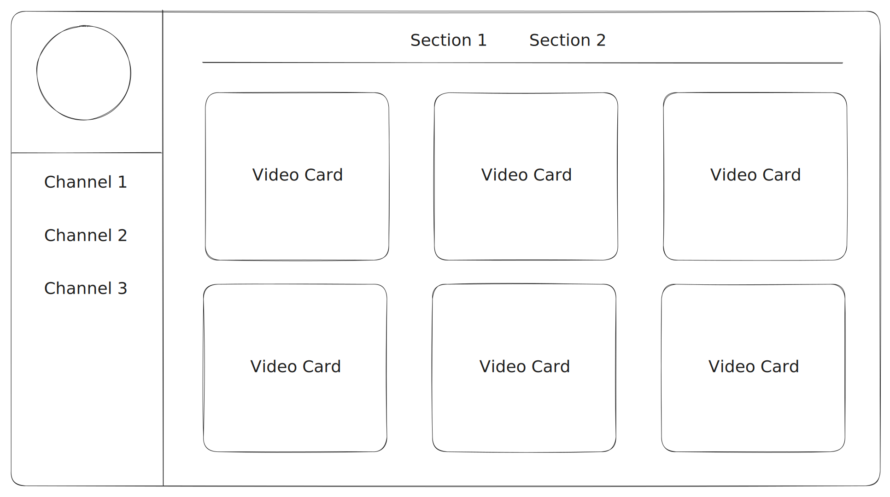

## Project Overview

An application for streamers and content creators that they can use to make their own dynamic full-fledged website with the following features:
    - User Register and Login
    - User Engagement (likes and comments)
    - User bookmark list
    - Email subscription (get an email for any new publication)

Streamers can signup with their twitch account, and the application shall create automatically a twitch channel with all twitch streams section.

Streamers can create different channels in their page and each channel can contain different sections. For example the auto-generated twitch channel contains only "streams" section, however custom sections like: "clips", "league of legends", "just chatting", etc, can be added manually.

Streamers may add custom channels manually as well like "Youtube", however they will fill it with content themselves. Also streamers may change the theme of the page, for each channel; like with the user clicks on the twitch channel the colors change to purple, and when switch to Youtube the colors change to red.

Sections are simply grid of publications (videos) that when clicked, a popup of the publication appears in which users can watch the (embedded) video, react to, and/or comment on it.



> Figma Prototype: [https://www.figma.com/design/...](https://www.figma.com/design/YbLZSnut1PZnFhx9y0t0z8/FollowUp?node-id=0-1&t=mEin5TBGmdwTm7Ny-1)

## Used Technologies

- [Golang](https://go.dev/)
- [Templ](https://templ.guide/)
- [Tailwind](https://tailwindcss.com/)
- [HTMX](https://htmx.org/)
- [Fiber](https://docs.gofiber.io/)
- [Postgres](https://github.com/jackc/pgx)

## Usage

Download the source code or just clone this repository and delete .git directory:

```shell
$ git clone https://github.com/mmoehabb/goweb-template
$ rm -rf .git
$ git init # optional
```

> Make sure you have installed [go](https://go.dev/doc/install) and [templ](https://templ.guide/quick-start/installation):

Install the dependencies with; execute the following command on the root directory:

```shell
$ go install
```

Then, write the following command to compile templ files and run the server afterwards:

```shell
$ templ generate --cmd "go run ."
```

If everything went right, you should be able to see the template live on [http://localhost:3000](http://localhost:3000)

You can also enable live reload with the command:

```shell
$ templ generate --watch --cmd "go run ."
```

However this will watch only templ files, you may wanna reload the server when go files are modified as well.
For this sake `.air.toml` file (as you may have noticed) is in the root directory; make sure to install [air](https://github.com/air-verse/air) then execute the previous command with `air` instead of `go run .`.

```shell
$ templ generate --watch --cmd "air"
```

### ./cmd (Only Linux)

You may use the `./cmd` file placed in the root directory, as a shorthand for the above-mentioned commands:

```shell
$ chmod +x ./cmd
$ ./cmd dev # executes: "templ generate --watch --cmd 'air'"
```
